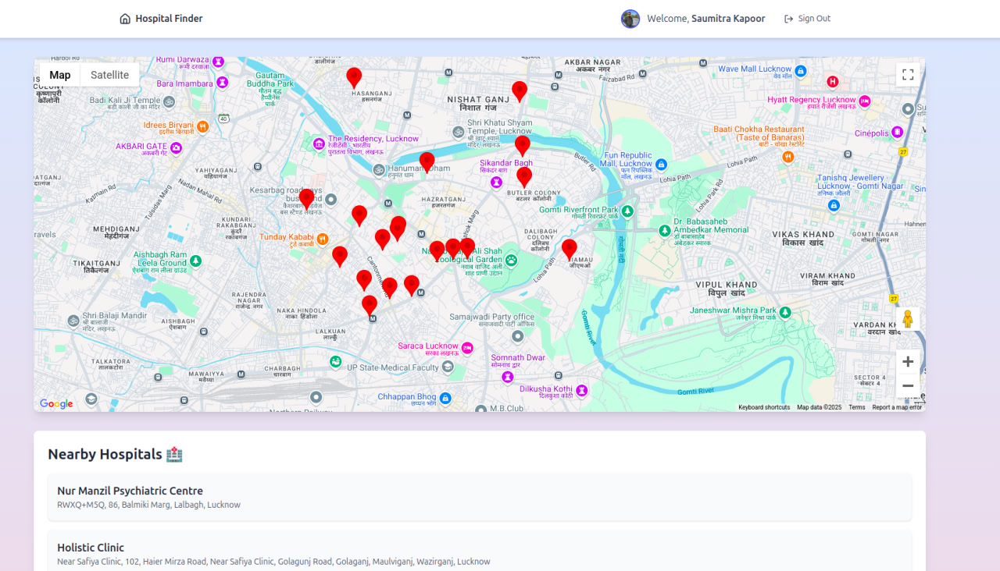

# 🏥 Hospital Finder

Hospital Finder is a web application that helps users locate nearby hospitals using an interactive map. Users can sign in with Google, view hospital locations, and get a list of hospitals based on their location.

---

## 🚀 Features
- 🔍 **Find Nearby Hospitals** – Displays hospitals based on user location.
- 🗺️ **Interactive Map** – Google Maps integration to visualize hospital locations.
- 🔐 **Google Authentication** – Secure sign-in with Google.
- 📜 **Hospital Listings** – View details of nearby hospitals in a structured list.

---

## 📸 Preview



---

## 🛠️ Tech Stack
- **Frontend:** React, Tailwind CSS
- **Backend:** Firebase Authentication
- **APIs:** Google Maps API

---

## 📦 Installation
### 1️⃣ Clone the Repository
```sh
git clone https://github.com/kapoorsaumitra/hospitalfinder.git
cd hospitalfinder
```

### 2️⃣ Install Dependencies
```sh
npm install
```

### 3️⃣ Set Up Firebase
Create a `.env` file in the root directory and add your Firebase credentials:
```sh
VITE_API_KEY=your_api_key
VITE_AUTH_DOMAIN=your_auth_domain
VITE_PROJECT_ID=your_project_id
VITE_STORAGE_BUCKET=your_storage_bucket
VITE_MESSAGING_SENDER_ID=your_messaging_sender_id
VITE_APP_ID=your_app_id
```

### 4️⃣ Run the Project
```sh
npm run dev
```

---
